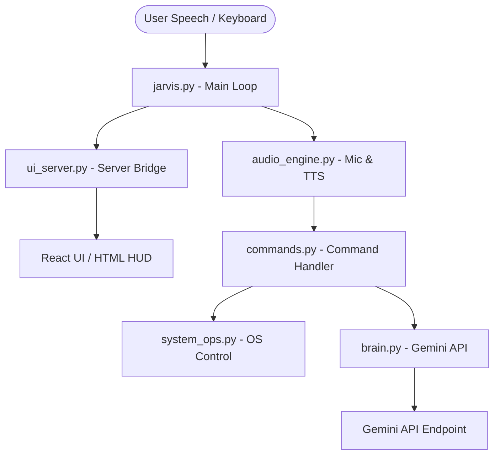

# ╔══════════════════════════════════════════════╗
# ║         J.A.R.V.I.S  —  Just A Rather Very Intelligent System ║
# ║              Voice-Activated Personal AI Assistant           ║
# ╚══════════════════════════════════════════════╝

J.A.R.V.I.S is a futuristic, voice-controlled personal AI assistant for Windows, powered by the Google Gemini API. It features a cinematic, web-based 3D HUD interface, offline console keyboard fallback, automated room/microphone calibration, and native system integration to control apps, folders, volume, brightness, screenshots, and power states.

---

## 🚀 Key Features

*   🎤 **Voice & Clap Activation**: Wake-word-free voice triggering (always listening for commands), double-clap detection to activate, or classic voice activation ("Hey Jarvis").
*   🧠 **Gemini AI Brain**: Dynamic conversation powered by Google Gemini (`gemini-2.5-flash` with automatic lite/flash fallback models). Remembers recent context for seamless follow-up interactions.
*   🌐 **Cinematic 3D HUD**: Web-based interface built with **React, Vite, Framer Motion, and Three.js / React Three Fiber** on `http://localhost:5050`. Displays real-time Jarvis states (idle, listening, thinking, speaking), command logging, and hardware usage metrics.
*   💻 **Windows System Operations**:
    *   **App Launcher & Terminate**: Start or close processes (Chrome, VS Code, Notepad, Calculator, Task Manager, etc.).
    *   **Folder Navigator**: Quick access to default folders (Desktop, Downloads, Documents, Projects) or custom file paths.
    *   **Volume & Brightness Controls**: Precise master volume adjustment (via `pycaw`) and screen brightness tuning (via `screen-brightness-control`).
    *   **Screenshots**: Captures your screen and saves it straight to the Desktop.
    *   **Live System Diagnostics**: Audio reports of current CPU, RAM, GPU utilization, and Battery status.
    *   **PC Power Management**: Locked screen, sleep mode, and confirmation-guarded system shutdowns or restarts (which can be cancelled mid-countdown).
*   🎵 **Spotify Controller**: Launch Spotify, search for songs/artists, or trigger themed playlists (chill, focus, workout, sleep).
*   ⌨️ **Console Fallback**: No mic? No problem. Simply press `ENTER` in the terminal and type commands directly.

---

## 🛠️ System Architecture

The project is modularized into dedicated components:



*   `jarvis.py`: The entry point. Handles setup, threading for the UI server, and console inputs.
*   `audio_engine.py`: Manages PyAudio capture, double-clap logic, voice activity detection (VAD), and Text-to-Speech output.
*   `ui_server.py`: Runs a local HTTP bridge server to feed live application states and system stats to the frontend.
*   `commands.py`: Parses transcriptions and determines whether to perform a system action or request an answer from the AI.
*   `system_ops.py`: Low-level wrapper executing PowerShell scripts, ctypes API calls, and reading diagnostic parameters.
*   `brain.py`: Manages history buffering, payload formulation, and API connection to Google Generative AI.
*   `config.py`: Centralized configuration variables for user details, keywords, and folder/app shortcuts.

---

## 📋 Prerequisites & Installation

### 1. Python Environment Setup
Install the necessary system dependencies. For full functionality, the following packages are required:

```bash
pip install numpy PyAudio SpeechRecognition pyttsx3 requests psutil GPUtil pyautogui screen-brightness-control pycaw comtypes
```

> [!NOTE]  
> If you experience errors installing `PyAudio` on Windows, download the appropriate precompiled wheel for your Python version from official sources or run:
> ```bash
> pip install pipwin
> pipwin install pyaudio
> ```

### 2. Configure Gemini API Key
Jarvis needs a Gemini API key to power its conversational responses.
1. Get a free API Key from [Google AI Studio](https://aistudio.google.com/).
2. Create a file named `.env` in the root folder of this project:
   ```env
   GEMINI_API_KEY=your_actual_api_key_here
   ```

### 3. Build the Frontend HUD (Optional but Recommended)
The project comes with a gorgeous, high-fidelity Three.js HUD dashboard in the `frontend` folder.
To compile it:
```bash
cd frontend
npm install
npm run build
```
*If not compiled, the server will automatically serve a fallback static HUD page (`jarvis_hud.html`) so the system remains operational.*

---

## 🚀 Running Jarvis

1. Open a terminal in the root directory and execute:
   ```bash
   python jarvis.py
   ```
2. The UI server will boot on `http://localhost:5050` and automatically launch the HUD in your default web browser.
3. Jarvis will calibrate your room's ambient noise levels for 1.5 seconds. Once finished, you will hear a confirmation message: *"Jarvis online. Good to see you, Boss."*

### Ways to Interact
*   **Speak Directly**: If `ALWAYS_LISTEN` is active, say commands like *"open YouTube"* or *"what is the time"*.
*   **Double-Clap**: Clap twice within 1.2 seconds to manually wake Jarvis up.
*   **Press Enter**: Press `ENTER` in the command window to pause recording and type commands directly.

---

## ⚙️ Customization (`config.py`)

You can edit `config.py` to adapt Jarvis to your personal preference:

*   `YOUR_NAME`: Changes how Jarvis addresses you (default: `"Boss"`).
*   `YOUR_CITY`: City location used for automated weather queries (default: `"Hyderabad"`).
*   `APPS`: Dictionary mapping spoken app names to target executable commands.
*   `FOLDERS`: Paths pointing to your localized system directories.
*   `SPOTIFY_PLAYLISTS`: Connect your favorite Spotify playlist links for direct access.
