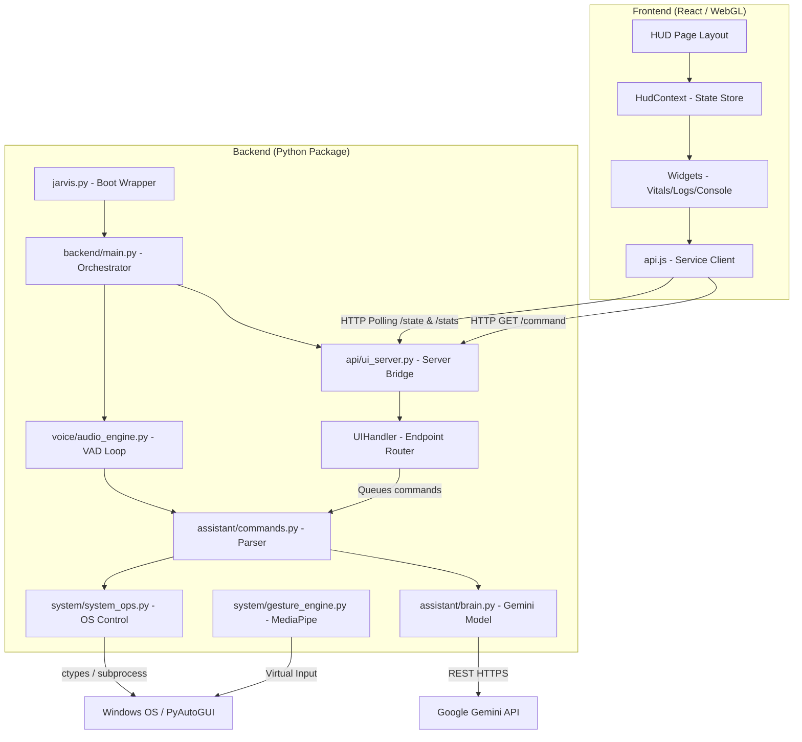

# System Architecture — J.A.R.V.I.S

This document outlines the detailed system architecture of J.A.R.V.I.S (Just A Rather Very Intelligent System), describing how the backend and frontend components interact, the data flow paths, threading models, and hardware integrations.

---

## 1. Architectural Overview

J.A.R.V.I.S is divided into a **Python modular backend** and a **React-based WebGL frontend**. They communicate locally over HTTP/JSON.

---

## 2. Backend Package Structure (`backend/`)

The Python backend is structured as a decoupled package to ensure separate concerns:

### 1. `backend/core/` (Core Configuration)
- **`config.py`**: Declares user parameters (names, local cities), wake words, audio constants (sample rates, thresholds), application process bindings, and directory shortcut pathways. 
- Prevents hardcoding parameters inside system scripts.

### 2. `backend/assistant/` (Cognitive & Control Services)
- **`brain.py`**: Integrates with the Google Generative AI REST endpoint using model fallback loops (Vite/Flash Lite series) and maintains active query buffers to support contextual chat memory.
- **`commands.py`**: A pattern-matching routing engine that analyzes strings and determines if they represent native desktop queries (like opening files, controlling audio volume, taking screenshot) or conversational inputs.

### 3. `backend/voice/` (Hardware Audio Interface)
- **`audio_engine.py`**: Manages the PyAudio interface stream, handles room sound calibration on boot, detects double-claps, executes voice activity detection (VAD), and drives the Text-to-Speech (TTS) speaker lock queue.

### 4. `backend/system/` (OS Control & Computer Vision)
- **`system_ops.py`**: Interfaces directly with Windows shell operations, battery diagnostics, GPUtil parameters, and volume controls.
- **`gesture_engine.py`**: Spawns an OpenCV video stream thread, processes frame captures through the MediaPipe Hands solution, and translates structural coordinates into mouse trajectories and keystrokes.

### 5. `backend/api/` (Network Gateway)
- **`ui_server.py`**: Operates a Python `http.server.HTTPServer` that hosts Web API routes (`/state`, `/stats`, `/command`) and serves static UI resources from `frontend/dist`.

---

## 3. Data & Communication Flows

### A. Voice Activation Flow
1. **Always-Listen Loop**: `audio_engine.py` reads PCM frames from the default input device.
2. **Impulse Trigger**: If the root-mean-square amplitude surpasses the calibrated speech threshold, frame capturing starts.
3. **Speech Transcription**: Captured frames are combined and compiled via `speech_recognition` (Google STT API).
4. **Command Routing**: The string transcript is checked in `commands.py` against active lists of system triggers.
   - **System Match**: Runs local operations (e.g., launching an executable via `subprocess`).
   - **Gemini Query**: Formulates a request containing the prompt, system prompt, and context buffer, posts it to the Gemini REST API, and parses the response.
5. **Speech Playback**: The result is queued in `speak()`, changing the HUD state and invoking the TTS voice engine.

### B. UI Polling Flow
1. **Frontend Init**: On page load, `HudContext` sets up two active `setInterval` loops.
2. **State Updates** (Every 350ms): Fetches `/state` to obtain current assistant status (listening, thinking, speaking), command logs, and responses.
3. **Stat Reports** (Every 1500ms): Fetches `/stats` to retrieve hardware percentages (CPU, RAM, GPU utilization, and battery life).
4. **Local React Renders**: State triggers update the UI, triggering animations and rendering 3D WebGL meshes.

---

## 4. Multithreading Model

To ensure audio captures, webcam frame processing, and web requests do not block each other, J.A.R.V.I.S runs a highly multithreaded architecture:

- **Main Thread**: Orchestrates the bootstrap and maintains the main audio recording loop.
- **UI Server Thread**: A background daemon thread running the HTTP server, handling incoming requests.
- **Console Input Thread**: A daemon thread listening to keyboard `stdin` fallback inputs.
- **Holographic Gesture Thread**: Created dynamically when gesture control is enabled, keeping OpenCV and webcam processing separated from the primary audio pipeline.
- **Asynchronous Execution Threads**: Spanned for network tasks (like querying the Gemini model or submitting API commands) to avoid audio loop lag.
